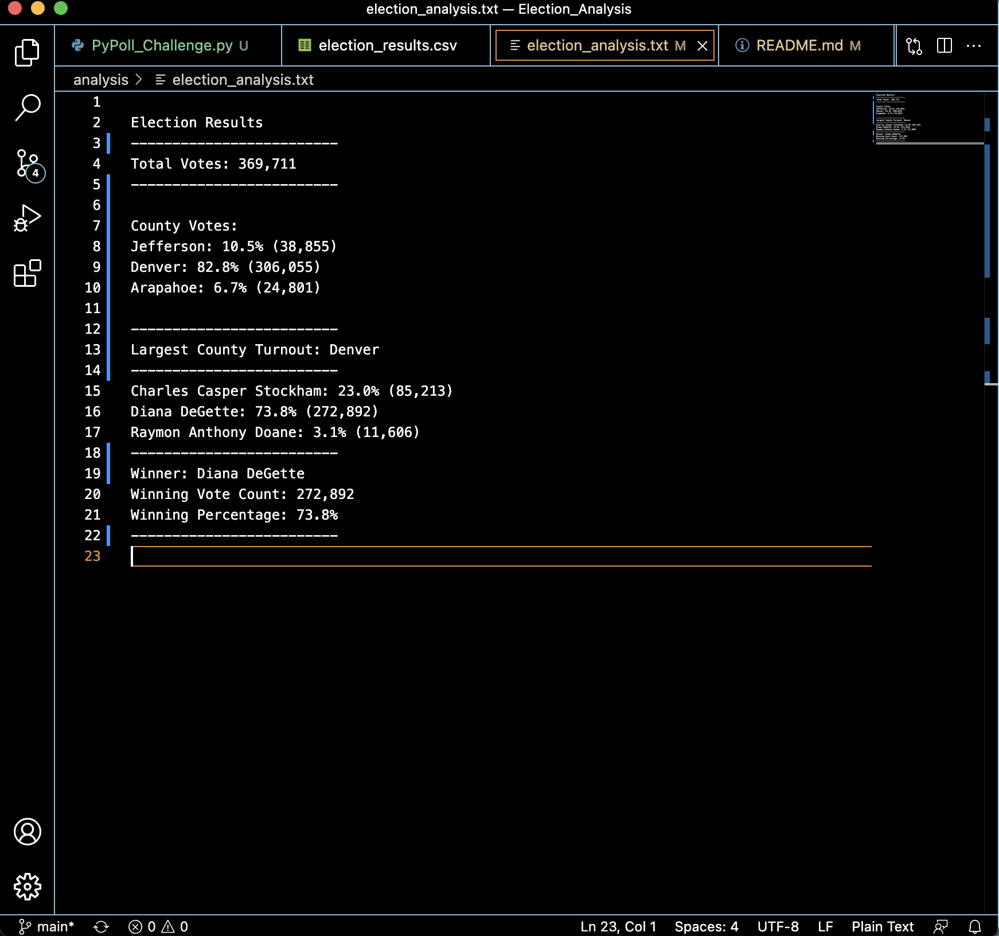

# Election Analysis

## Overview of Election Audit
In support of the election audit, our Python script needs to deliver the following information when it is ran: 
1. A complete list of candidates.
2. The total number of votes cast.
3. The total number of votes each candidate received. 
4. The percentage of votes each candidate won. 
5. The winner of the election based on popular vote. 
6. The voter turnout of each county.
7. The percentage of votes from each county. 
8. The county with the highest turnout. 

## Election Audit Results:
∙ After perfecting our script and executing our code it is shown that...
∙ There were a total of 369,711 votes cast in the congressional election.
∙ Votes by county were:
    ∙ Jefferson: 38,855 total votes, a 10.5%
    ∙ Denver: 306,055 total votes, a 82.8%
    ∙ Arapahoe: 24,801 votes, a 6.7%
∙ The county with the largest number of votes was Denver who again recorded 306,055 votes which is 82.8% of total votes. 
∙ Votes each candidate received were:
    ∙ Charles Casper Stockham: 85,213 votes, a 23.0%
    ∙ Diana DeGette: 272,892 votes, a 73.8%
    ∙ Raymon Anthony Doane: 11,606 votes, a 3.1%
∙ Candidate Diana DeGette won the election with a final vote count of 272,892, a 73.8% of total votes. 

### The picture found at the end of this analysis is a screenshot of these results. 

## Election Audit Summary
As we can see, our Python script provides a clear and easy to read summary of all the important details necessary for quick identification. Throughout module 3, we only delivered details about the candidates and the winner. However, once we incorporated the counties into our code we got a more clear picutre of where candidates received votes from. 

Not only is our script extremely usesful for this election, but it also serves aditional purposes and/or other elections with slight modification. If we were to add another if-statement that includes demographics about eligible voters per county, we could produce information about the percentage of each county that voted. With this information, we could then examine which counties have a lower voter turnout leading to further analysis to discover why and then providing the needed rersources to improve turnout in said counties in future elections. Adiitionally, our script can also be applied to all other elections including federal elections by simply swaping out the appropriate information on candidates, counties and votes. 

